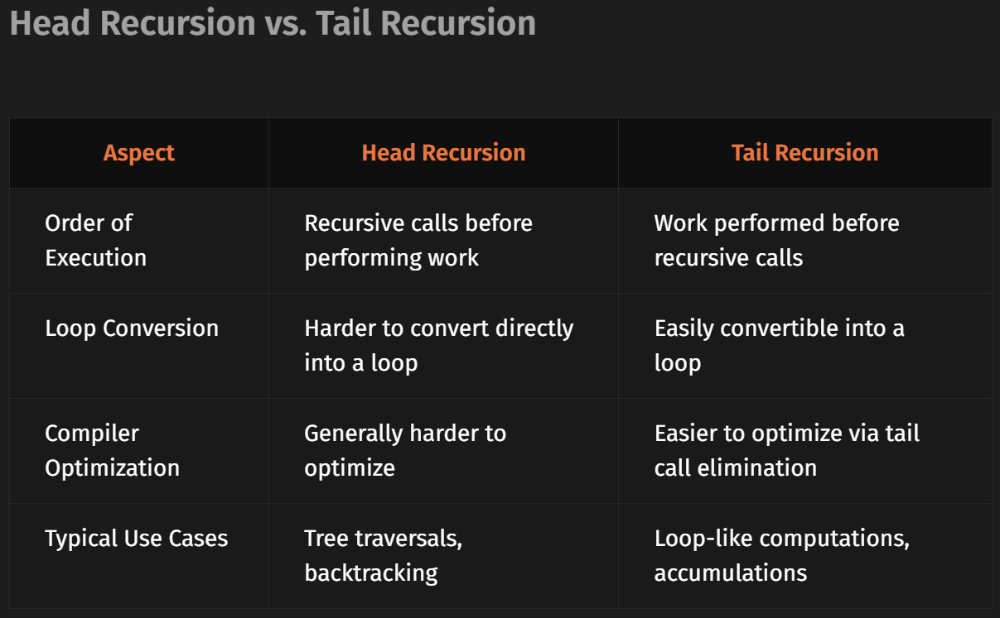

- Recursion occurs when a function calls itself directly or indirectly to solve a problem. It is an elegant approach to handle problems that can be broken down into smaller, similar subproblems.

- Infinite Recursion: Infinite recursion happens when a function does not have a base condition to stop the recursive calls. This leads to the function calling itself indefinitely, eventually causing a stack overflow.

- In head recursion, the recursive call occurs before any other processing in the function. The function waits for the recursive call to return before proceeding with any operation.

- In tail recursion, the recursive call is the last operation in the function. Once the function calls itself, there is no need to retain the current function's state, allowing the compiler to optimize tail recursion.

- Any local machine has a limited resources. Stack overflow occurs when too many recursive calls are made without a base case, or the recursion depth exceeds the system's call stack limit. This causes the program to crash as the system runs out of stack space.

- In head recursion, the tree grows downward as the function waits for each recursive call to complete before executing the remaining operations.

- In tail recursion, the recursion tree is simpler since each recursive call is the last operation, leading to more straightforward unwinding of the stack.

- The time complexity of a recursive function is generally based on the number of recursive calls made. If a function makes one recursive call, the time complexity is O(n), where n is the depth of the recursion.

- The space complexity of a recursive function is determined by the maximum depth of the recursive call stack. If the function reaches a maximum recursion depth of n, the space complexity is O(n).

- Parameterized recursion involves passing all required information as parameters to the recursive function. This approach results in:
    - Better control over recursion flow
    - Cleaner and more maintainable code
    - Independence from external or global state

