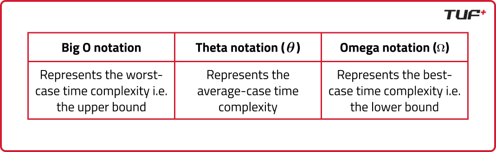

- Time Complexity: The amount of time an algorithm takes to complete as a function of the input size. It provides a way to quantify the efficiency of an algorithm by expressing how the execution time grows as the input size increases.

- Space Complexity: The amount of memory an algorithm uses as a function of the input size. It accounts for the total amount of space required by the algorithm, including the space used by variables, data structures, and function call stacks.

- Actual time taken to run the code cannot be solely relied upon to determine time complexity due to factors like server specifications and environmental conditions.

- The rate of change in the execution time as the input size increases can be expressed as:

(input2 - input1) / (time2 - time1)

This rate of change is what defines the time complexity of an algorithm. Time complexity is often measured using Big O notation, which provides an upper bound on the time taken as a function of the input size.

- 

- Space complexity measures the amount of memory an algorithm requires as a function of the input size. It is a critical aspect of algorithm efficiency, especially in memory-constrained environments. Space complexity can be broken down into two main components:
    - Auxiliary Space: This refers to the extra space or temporary space used by the algorithm, apart from the input data. It includes variables, data structures, and function call stacks that the algorithm utilizes during execution.
    
    - Input Space: This is the memory occupied by the input data itself. In many cases, the input space is considered negligible when analyzing space complexity, as it is independent of the algorithm's operations.