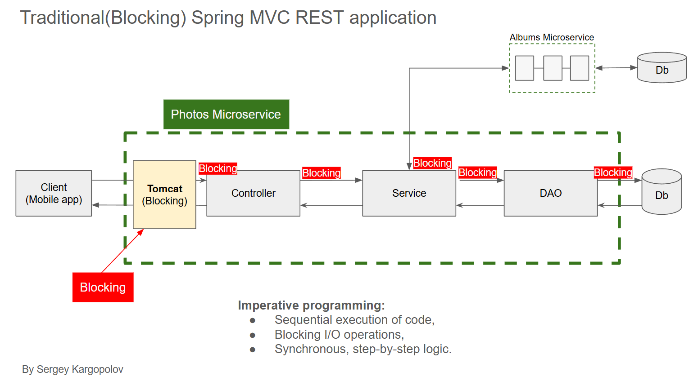
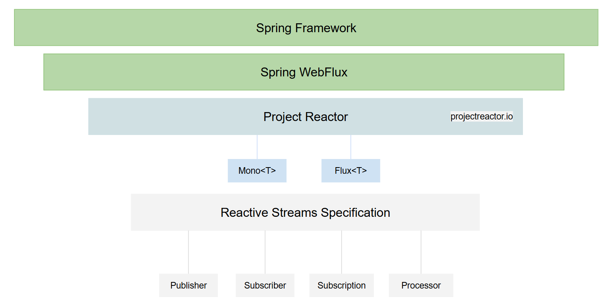
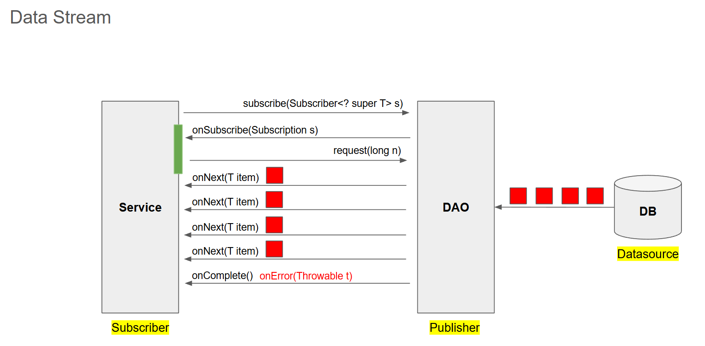
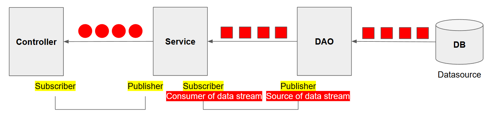
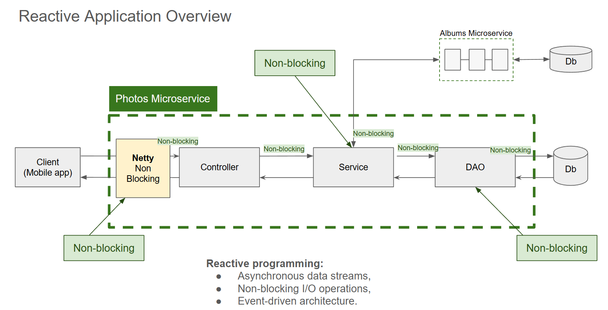
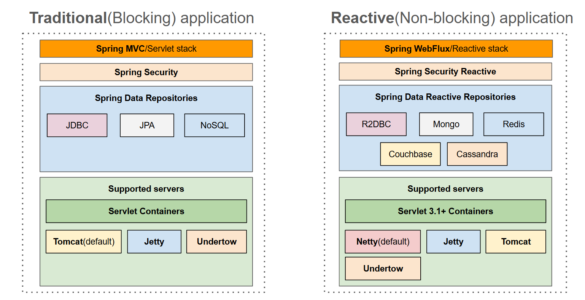
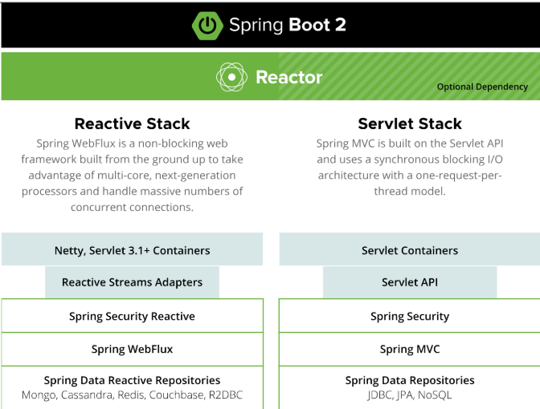
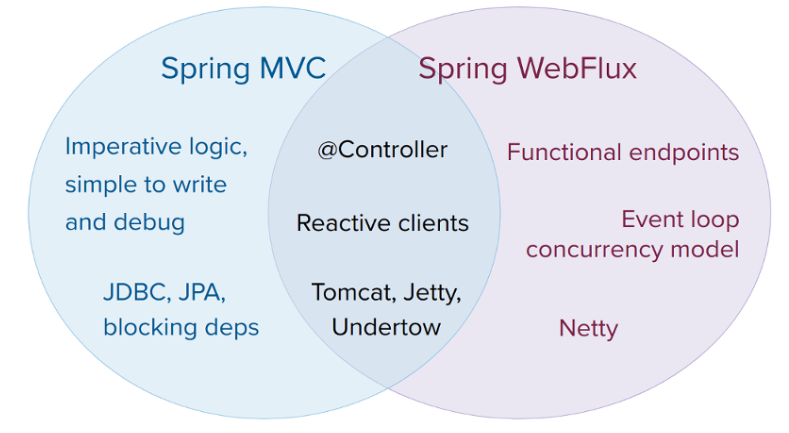

### Spring MVC

- Spring MVC is fundamentally based on the "thread-per-request" model.

- In this traditional, synchronous and blocking architecture, a dedicated thread from a servlet container's (like Apache Tomcat, the default in Spring Boot) thread pool handles a single request from start to finish.

- Key Characteristics of the Thread-Per-Request Model in Spring MVC:
    - Dedicated Thread: Each incoming HTTP request is assigned a thread that is exclusively used for that request until the response is sent back to the client.
    
    - Blocking I/O: If the request handling involves I/O operations (like database calls, file system access, or external API calls using a tool like RestTemplate), that specific thread will block and wait until the operation is complete. During this waiting time, the thread is idle and cannot be used to process other requests.
    
    - Thread Pools: To mitigate the inefficiency of blocking, servlet containers maintain a large thread pool (e.g., Tomcat's default max pool size is 200) to handle a significant number of concurrent requests.
    
    - Simplicity: This model is generally considered easier to understand and debug because the entire execution flow of a single request happens on one thread.

- Solutions to Thread per Request Architecture:
    - Configure Tomcat to allocate more threads.
    - Vertical scaling (add more memory, and more CPU cores)
    - Horizontal Scaling (add more servers)
    - Java 21 (Project Loom and Virtual Threads)
    - Reactive programming with non-blocking I/O.

### Spring Webflux

- Enables developers to build non-blocking applications that can handle asynchronous and synchronous operations

- Focuses on data streams and the propagation of change.

- Useful for applications that need to handle a large number of concurrent users or data streams efficiently.

- Typically employs a functional programming style rather than an imperative one.
    - Reactive Streams to handle data flow
    - Lambda functions for concise code
    - Operators like map() and filter() to process data.

- Back pressure is a way for Subscribers to manage how much data they receive from Publishers.

- Spring WebFlux
    - A non-blocking web framework from Spring.
    - Handles large number requests with fewer resources,
    - Supports reactive programming model. 

- How Spring WebFlux is different?
    - Reactive programming
    - Supports both imperative and reactive programming styles.

- Presentation Layer:
    - @RestController
    - @Controller

- Service Layer: (business logic)
    - @Service
    - @Bean

- Data Layer:
    - @Entity
    - @Repository

- Infrastructure Layer:
    - @Configuration
    - @EnableWebSecurity
    - @Bean

- Controller Advice: 
    - Controller advice is a feature in Spring framework that allows you to define global exception handlers for your application.
    - It is useful when you want to handle exceptions across multiple controllers without duplicating exception handling code.

- Controller Advice Advantages:
    - Centralized exception handling.
    - Consistent error responses across the application.
    - Separation of concerns between business logic and error handling.
    - Improved code maintainbility.

- @ControllerAdvice is used for both traditional Spring MVC controllers and RESTful controllers.

- @RestControllerAdvice is specifically designed for use with @Restcontroller. It combines the behavior of @ControllerAdvice and @ResponseBody.

- When using @ControllerAdvice, you may need to add @ResponseBody to your methods if you want to return data directly rather than a view name.

- With @RestControllerAdvice, @ResponseBody is automatically applied to all methods, meaning the return values are automatically serilized to the response body. 