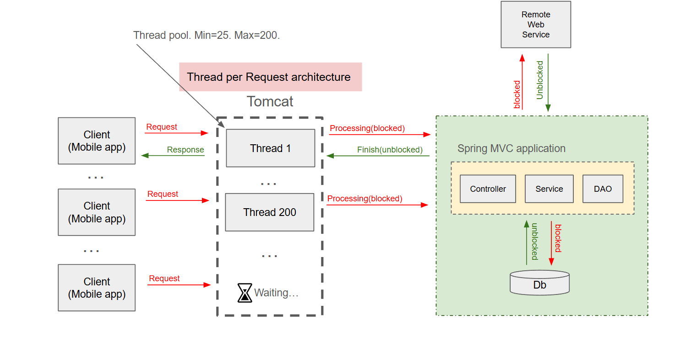

- Spring MVC is fundamentally based on the "thread-per-request" model.

- In this traditional, synchronous and blocking architecture, a dedicated thread from a servlet container's (like Apache Tomcat, the default in Spring Boot) thread pool handles a single request from start to finish.

- Key Characteristics of the Thread-Per-Request Model in Spring MVC:
    - Dedicated Thread: Each incoming HTTP request is assigned a thread that is exclusively used for that request until the response is sent back to the client.
    
    - Blocking I/O: If the request handling involves I/O operations (like database calls, file system access, or external API calls using a tool like RestTemplate), that specific thread will block and wait until the operation is complete. During this waiting time, the thread is idle and cannot be used to process other requests.
    
    - Thread Pools: To mitigate the inefficiency of blocking, servlet containers maintain a large thread pool (e.g., Tomcat's default max pool size is 200) to handle a significant number of concurrent requests.
    
    - Simplicity: This model is generally considered easier to understand and debug because the entire execution flow of a single request happens on one thread.

- Solutions to Thread per Request Architecture:
    - Configure Tomcat to allocate more threads.
    - Vertical scaling (add more memory, and more CPU cores)
    - Horizontal Scaling (add more servers)
    - Java 21 (Project Loom and Virtual Threads)
    - Reactive programming with non-blocking I/O.